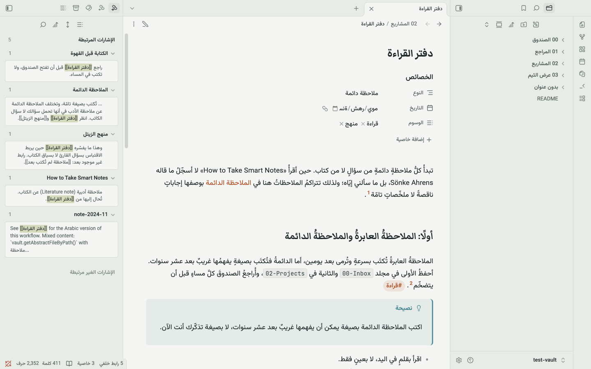
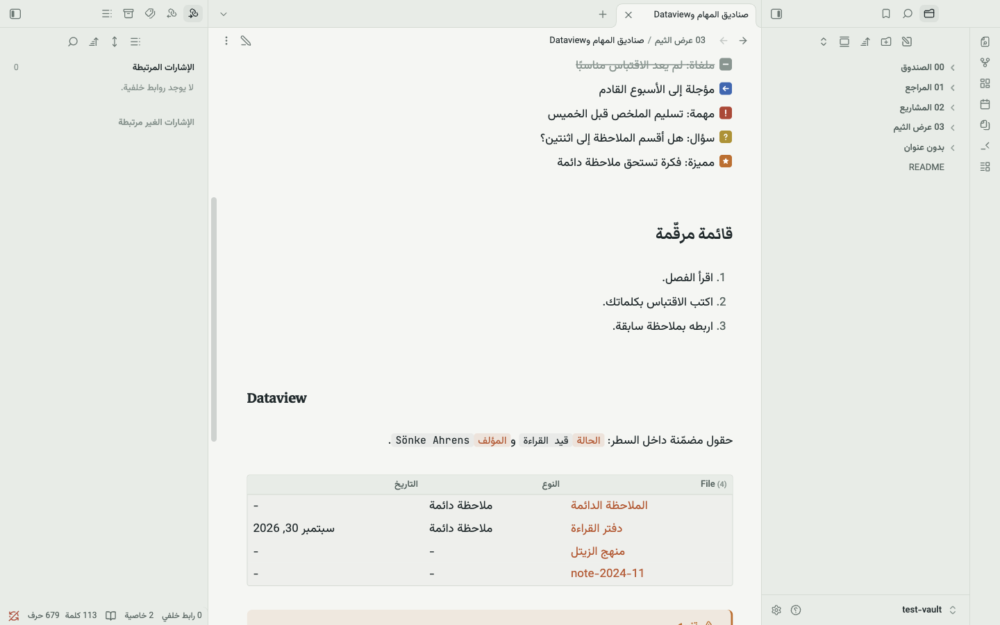
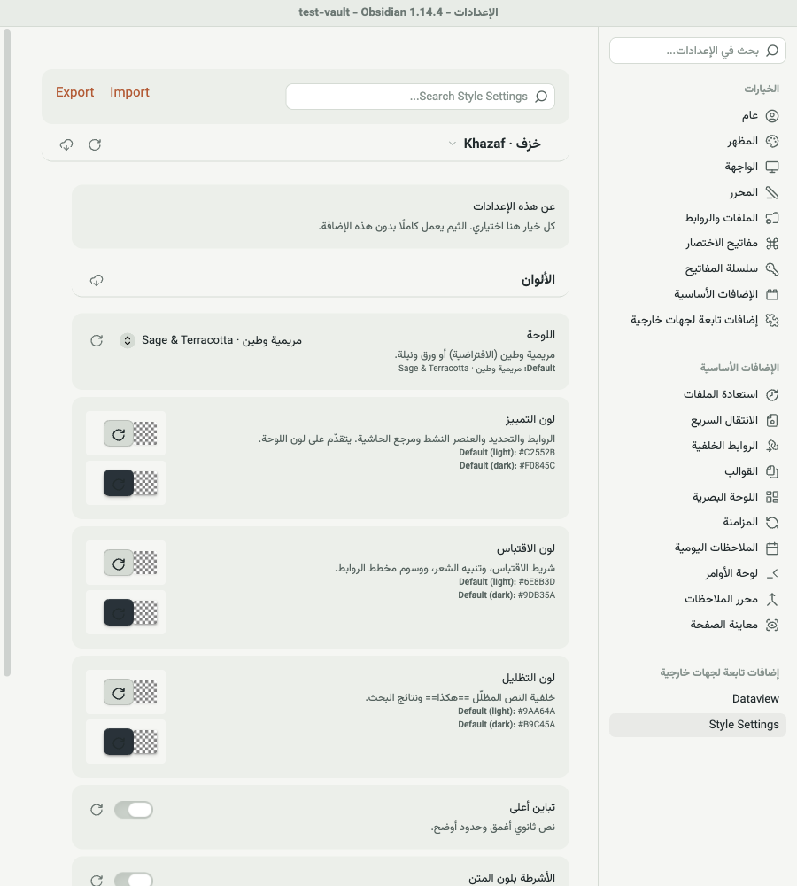

<p align="center">
  
</p>

<h1 align="center">Khazaf · خَزَف</h1>

<p align="center">An Arabic-first Obsidian theme for long-form writing: misty surfaces, slate ink and a touch of terracotta.</p>

<p align="center">
  <a href="https://github.com/iSltanX/obsidian-khazaf/releases/latest"></a>
  <a href="LICENSE"></a>
  
</p>

<p align="center">
  <a href="#previews">Previews</a> ·
  <a href="#installation">Installation</a> ·
  <a href="#style-settings">Style Settings</a> ·
  <a href="#poetry">Poetry</a> ·
  <a href="#development">Development</a> ·
  <a href="README.md">العربية</a>
</p>

## About

*Khazaf* is Arabic for ceramic: fired clay under a sage glaze. The theme is built for people who write a lot of Arabic in Obsidian. Body text is the focus; panes and tools stay legible without competing with it. Terracotta appears only where it matters: links, the active item and footnote references.

It was designed as a full system in Figma first, then built and tested inside Obsidian with the Arabic interface.

## Previews

Real screenshots from Obsidian 1.14.4.

| Reading · light | Reading · dark |
|---|---|
|  |  |
| **Live Preview · dark** | **Alternate checkboxes & Dataview** |
|  |  |

<p align="center">
  
  
  
</p>

## Features

- **Arabic typography.** Vazirmatn body at 17px with a 1.75 line height so diacritics never collide; Markazi Text (Naskh) for h1–h3; a 700px line of roughly 70–85 Arabic characters.
- **Footnotes.** Bracket-less superscript numbers, a smaller footnote list, a ↩ back-link and a highlighted `:target`.
- **Blocks.** Callouts with an inline-start bar and type-colored titles; a light-weight blockquote instead of italics; zebra tables; pill tags.
- **Code.** Always LTR inside Arabic notes, Arabic comments read correctly, horizontal scroll on mobile instead of wrapping.
- **Interface.** Fully mirrored RTL workspace, light and dark modes with the same character, slate (not pure black) dark surfaces on mobile.
- **Customizable.** 20+ options through Style Settings, two color schemes (Sage & Terracotta, Paper & Indigo), six alternate checkboxes and note classes for wide, compact and poetry notes.
- **Plugins.** Dataview tables and inline fields, graph colors, and every option exposed to Style Settings.
- **No dependencies.** All three fonts are embedded as WOFF2, so the theme works on desktop, mobile and offline with no plugins. Style Settings is optional.


## Installation

**From the theme store:** Khazaf is listed in the [Obsidian theme directory](https://community.obsidian.md/themes/khazaf). Click “Add to Obsidian” there, or go to Settings → Appearance → Themes → Manage and search for **Khazaf**.

**Manually:** download `theme.css` and `manifest.json` from the [latest release](https://github.com/iSltanX/obsidian-khazaf/releases/latest) into `<vault>/.obsidian/themes/Khazaf/`, then select Khazaf under Settings → Appearance.

Recommended app settings (not forced by the theme): interface language Arabic, editor right-to-left, font size 17, readable line length on.

## Style Settings

Install [Style Settings](https://github.com/obsidian-community/obsidian-style-settings), then open Settings → Style Settings → Khazaf · خزف. Options are shown in Arabic when the interface is Arabic.



- **Colors:** scheme (Sage & Terracotta / Paper & Indigo), accent, quote and highlight colors, higher contrast, flat sidebars.
- **Typography:** body font, heading font, line width, line height, paragraph spacing, Arabic-Indic numbers in ordered lists.
- **Blocks:** callout style (bar / outline / soft), blockquote style (light / naskh / regular), footnote brackets, footnote size, poetry size, accent-colored headings, plain checkboxes only, code wrapping.
- **Interface:** hide file-tree guides, hide the Properties heading, hide the status bar (also a command).

**Alternate checkboxes:** `[/]` in progress, `[-]` cancelled, `[>]` deferred, `[!]` important, `[?]` question, `[*]` star.

**Note classes** (`cssclasses`): `khazaf-wide`, `khazaf-compact`, `khazaf-poetry`.

**CSS snippets** still work for anything else:

```css
body { --khazaf-font-heading: "Amiri", serif; }
.theme-light { --accent-h: 200; --accent-s: 60%; --accent-l: 40%; }
```

## Poetry

```markdown
> [!verse]
> | | |
> |---|---|
> | وما نَيْلُ المطالبِ بالتمنّي | ولكنْ تُؤخَذُ الدنيا غِلابا |
```

The theme hides the table chrome, sets each hemistich in Markazi Text and stacks them below 480px. The note stays plain Markdown.

## Known issues (Obsidian itself)

- Date properties render empty with reversed placeholder letters in the Arabic UI (same with the default theme).
- Editor lines that start with a Latin character, e.g. `> [!tip]`, are laid out LTR because Obsidian picks each line's direction from its first strong character.

## Development

```bash
python3 scripts/fetch-fonts.py        # once: downloads and subsets fonts (needs fonttools + brotli)
./scripts/setup-test-plugins.sh       # once: Style Settings + Dataview in the test vault
python3 scripts/build.py              # after every change in src/
```

The build copies the theme into `test-vault/`; open that folder as a vault to try changes. To release, bump `version` in `manifest.json`, add a line to [CHANGELOG.md](CHANGELOG.md) and push a tag with the same number. See [CONTRIBUTING.md](CONTRIBUTING.md).

## Credits & license

Fonts: [Vazirmatn](https://github.com/rastikerdar/vazirmatn), [Markazi Text](https://github.com/Tarobish/Markazi), [JetBrains Mono](https://github.com/JetBrains/JetBrainsMono), all SIL OFL 1.1 ([fonts/NOTICE.md](fonts/NOTICE.md)). Icons: [Lucide](https://lucide.dev) via Obsidian. Theme code: [MIT](LICENSE).

---

<p align="center"><sub>
  Design &amp; development: Sultan — سلطان · <a href="https://bysltan.com">bysltan.com</a><br>
  Contact: <a href="mailto:iSultanby@gmail.com">iSultanby@gmail.com</a>
</sub></p>
