<div dir="rtl">

<p align="center">
  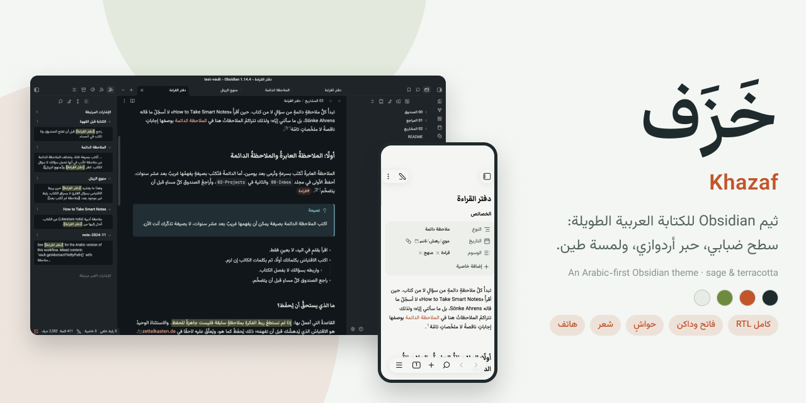
</p>

<h1 align="center">خَزَف · Khazaf</h1>

<p align="center">ثيم Obsidian للكتابة العربية الطويلة: سطح ضبابي، حبر أردوازي، ولمسة طين.</p>

<p align="center">
  <a href="https://github.com/iSltanX/obsidian-khazaf/releases/latest"></a>
  <a href="LICENSE"></a>
  
</p>

<p align="center">
  <a href="#المعاينة">المعاينة</a> ·
  <a href="#التثبيت">التثبيت</a> ·
  <a href="#التخصيص">التخصيص</a> ·
  <a href="#بيت-الشعر">بيت الشعر</a> ·
  <a href="#التطوير">التطوير</a> ·
  <a href="README.en.md">English</a>
</p>

## عن خزف

الاسم من الخزف: طينٌ مشويّ وطلاءٌ بلون المريمية. صُمّم الثيم لمن يكتب بالعربية كثيرًا داخل Obsidian، فجعل المتن مركز الاهتمام، وترك الأشرطة والأدوات واضحة دون أن تنافسه. اللون الطيني لا يظهر إلا على ما يهمّ: الرابط، والعنصر المحدد، ومرجع الحاشية.

صُمّم أولًا نظامًا كاملًا في Figma، ثم بُني واختُبر داخل Obsidian الفعلي بواجهة عربية.

## المعاينة

لقطات حقيقية من Obsidian 1.14.4.

| المعاينة الحية · داكن | وضع المصدر · فاتح |
|---|---|
| 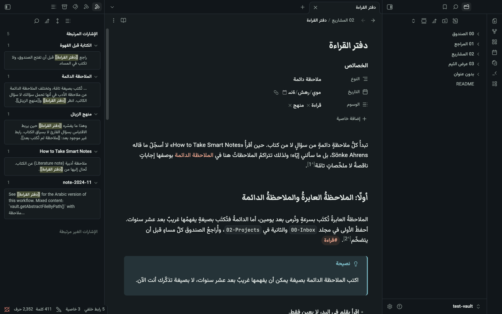 | 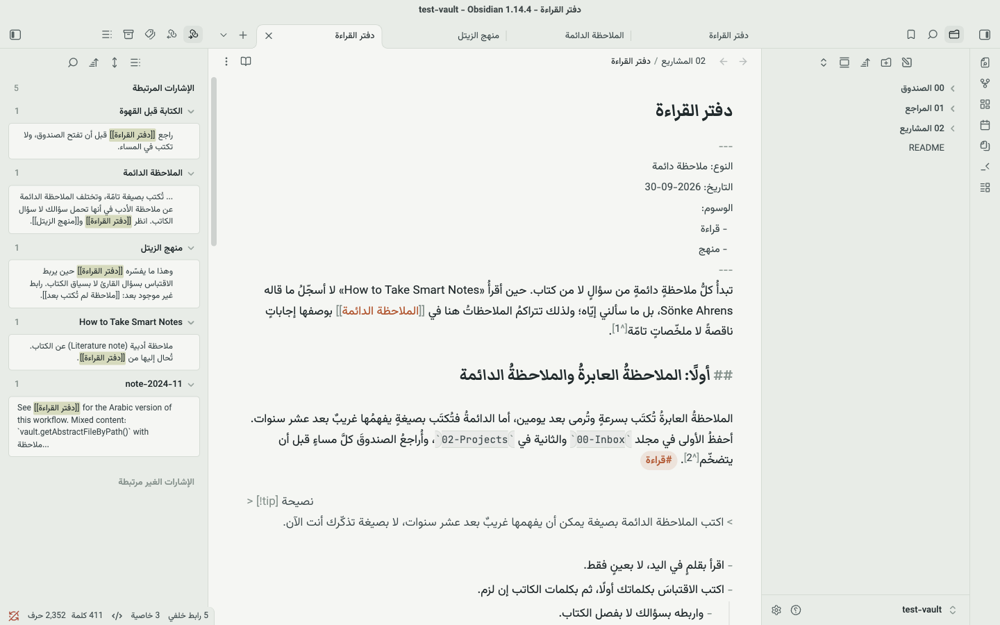 |
| **القراءة · داكن** | **المبدّل السريع · فاتح** |
| 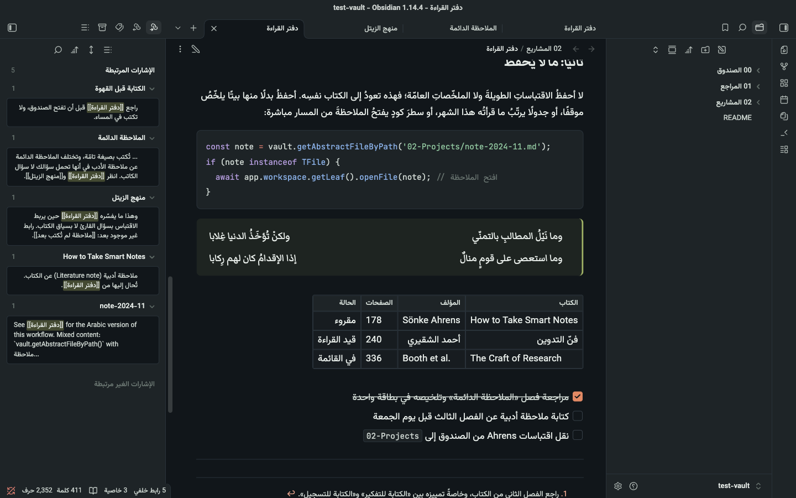 | 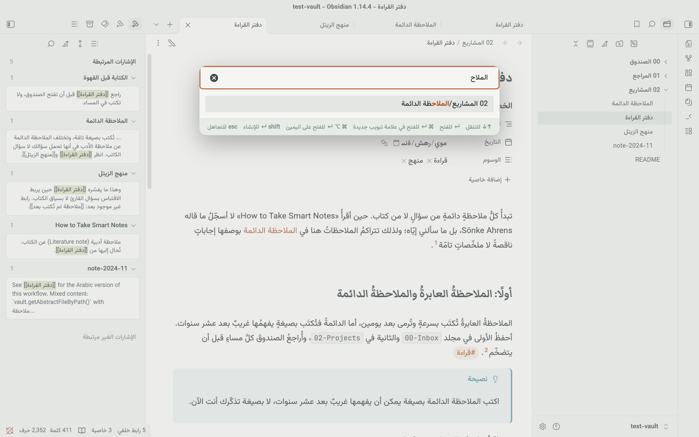 |

**على الهاتف**

<p align="center">
  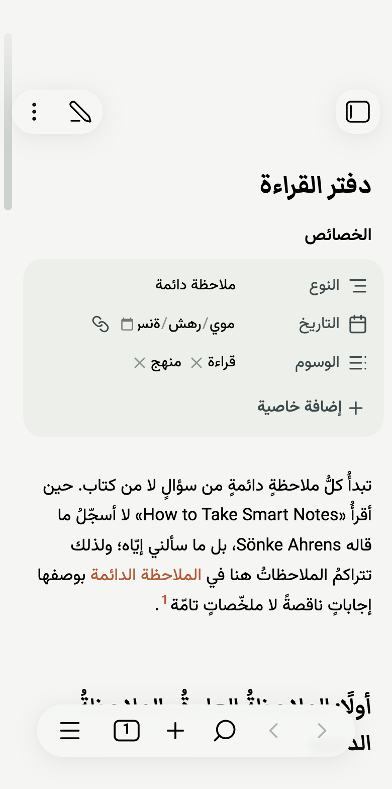
  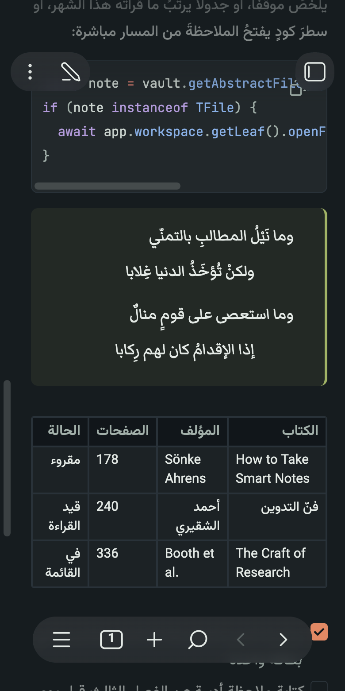
  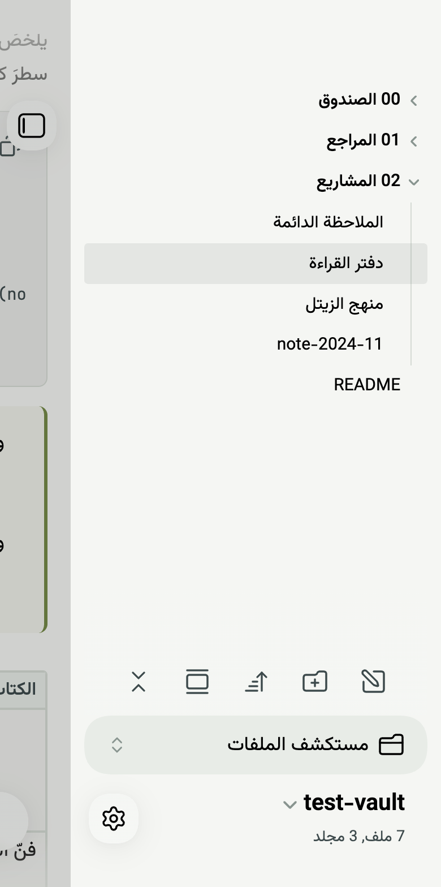
</p>

## المزايا

**القراءة والكتابة**
- المتن بخط Vazirmatn بحجم 17 وتباعد أسطر 1.75، حتى لا تتصادم الحركات بين الأسطر.
- العناوين الكبرى بخط Markazi Text النسخي، والصغرى بخط الواجهة لتبقى واضحة.
- سطر بعرض 700 بكسل، نحو 70 إلى 85 حرفًا عربيًا في السطر.

**الحواشي**
- المرجع رقم صغير بلا أقواس، بلون التمييز.
- قائمة الحواشي أسفل الملاحظة بخط أصغر، ورابط العودة ↩ بعد النص.
- الحاشية التي قفزت إليها تُظلَّل لتعرف مكانك.

**عناصر المتن**
- تنبيهات بشريط في بداية السطر وعنوان بلون نوعها.
- بيت الشعر بصدر وعجز متقابلين، يتراصّان على الشاشات الضيقة.
- الاقتباس بوزن خفيف بدل المائل، لأن العربية لا مائل لها.
- الكود من اليسار دائمًا داخل الملاحظة العربية، والعربية داخل تعليقاته تُقرأ صحيحة.
- جداول بصفوف متناوبة، ووسوم كحبّات، وصناديق مهام بلون الطين.

**الواجهة**
- واجهة معكوسة كاملة: الملفات في اليمين، والمخطط والروابط الخلفية في اليسار.
- وضعان فاتح وداكن بالشخصية نفسها.
- على الهاتف: أسطح أردوازية بدل الأسود الخالص، ولمس أسهل في شجرة الملفات، وكود يتمرّر بدل أن ينكسر.

**بلا اعتماديات**
- الخطوط الثلاثة مضمّنة داخل الثيم، فيعمل كما هو على الحاسب والهاتف ودون اتصال.
- لا يحتاج أي إضافة.

## اللوحة والخطوط

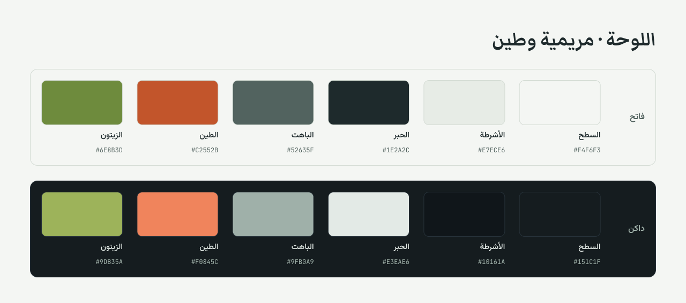

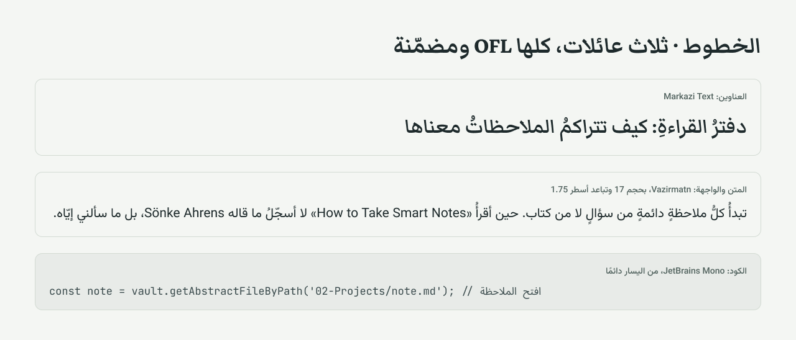

## التثبيت

### من متجر الثيمات

> الثيم بانتظار إدراجه في دليل Obsidian. هذه الطريقة تعمل بعد قبوله.

1. افتح **الإعدادات ← المظهر ← الثيمات ← إدارة**.
2. ابحث عن **Khazaf**.
3. اضغط **تثبيت واستخدام**.

### يدويًا

1. نزّل `theme.css` و`manifest.json` من [آخر إصدار](https://github.com/iSltanX/obsidian-khazaf/releases/latest).
2. ضعهما في هذا المجلد داخل قبوك، وأنشئه إن لم يكن موجودًا:
   ```
   .obsidian/themes/Khazaf/
   ```
3. أعد فتح Obsidian، ثم اختر **Khazaf** من **الإعدادات ← المظهر ← الثيمات**.

### التحديث

- إن ثبّته من المتجر: **الإعدادات ← المظهر ← الثيمات ← تحقق من التحديثات**.
- إن ثبّته يدويًا: استبدل الملفين بنسختهما من الإصدار الأحدث.

### إعدادات تكمّل الثيم

هذه إعدادات في Obsidian نفسه، والثيم لا يفرضها:

| الإعداد | المكان | لماذا |
|---|---|---|
| لغة الواجهة: العربية | الإعدادات ← عام ← اللغة | تعكس الأشرطة والقوائم (يحتاج إعادة تشغيل) |
| من اليمين إلى اليسار | الإعدادات ← المحرر | يجعل الاتجاه الافتراضي للمحرر عربيًا |
| حجم الخط 17 | الإعدادات ← المظهر ← حجم الخط | الحجم الذي صُمّم عليه الثيم |
| طول السطر المقروء | الإعدادات ← المحرر | يُفعّل السطر بعرض 700 بكسل |

## التخصيص

الثيم لا يعتمد على إضافة Style Settings في هذا الإصدار. لتغيير شيء، أنشئ مقتطف CSS:

1. افتح **الإعدادات ← المظهر ← مقتطفات CSS**، واضغط أيقونة المجلد.
2. أنشئ ملفًا باسم `khazaf-custom.css`، والصق فيه ما تريد مما يلي، ثم فعّله.

```css
/* خط آخر للعناوين، مثل Amiri إن كان مثبّتًا على جهازك */
body {
  --khazaf-font-heading: "Amiri", serif;
}

/* سطر أعرض */
body {
  --file-line-width: 780px;
}

/* لون تمييز مختلف في الوضع الفاتح (الدرجة، التشبع، الإضاءة) */
.theme-light {
  --accent-h: 200;
  --accent-s: 60%;
  --accent-l: 40%;
}

/* تباعد أسطر أضيق */
body {
  --line-height-normal: 1.65;
}
```

كل متغيرات Obsidian الموثقة تعمل أيضًا، وقائمتها في [توثيق Obsidian](https://docs.obsidian.md/Reference/CSS+variables/CSS+variables).

## بيت الشعر

اكتب البيت جدولًا بعمودين داخل تنبيه من نوع `verse`:

```markdown
> [!verse]
> | | |
> |---|---|
> | وما نَيْلُ المطالبِ بالتمنّي | ولكنْ تُؤخَذُ الدنيا غِلابا |
> | وما استعصى على قومٍ منالٌ | إذا الإقدامُ كان لهم رِكابا |
```

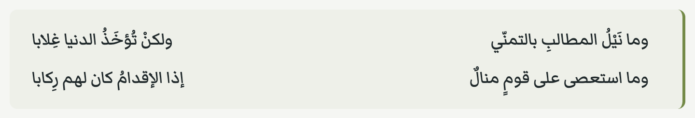

الملاحظة تبقى Markdown عاديًا. إن غيّرت الثيم يومًا ظهر البيت جدولًا مقروءًا داخل تنبيه.

## الإضافات

خزف يلوّن الإضافات الأساسية في Obsidian: البحث، والروابط الخلفية، والمخطط، والوسوم، والمبدّل السريع، ومعاينة الصفحة عند التحويم، وشريط أدوات الهاتف.

لم يُختبر بعد مع إضافات المجتمع، مثل Dataview وStyle Settings وKanban. إن ظهر خلل مع إحداها فافتح بلاغًا.

## قيود معروفة

هذه من Obsidian نفسه، وتظهر مع الثيم الافتراضي أيضًا:

- حقل التاريخ في الخصائص يظهر فارغًا وبحروف معكوسة في الواجهة العربية.
- السطر الذي يبدأ بحرف لاتيني، مثل `> [!tip] نصيحة`، يُعرض في المحرر من اليسار، لأن Obsidian يحدد اتجاه كل سطر من أول حرف فيه.

## المشكلات والاقتراحات

- **وجدت خللًا؟** افتح [بلاغًا](https://github.com/iSltanX/obsidian-khazaf/issues/new?template=bug_report.md) وأرفق لقطة شاشة، واذكر نسخة Obsidian والجهاز ولغة الواجهة.
- **عندك فكرة؟** افتح [اقتراحًا](https://github.com/iSltanX/obsidian-khazaf/issues/new?template=feature_request.md).

## التطوير

```
src/            مصدر الثيم مقسّمًا: المتغيرات، المتن، الواجهة، RTL، الهاتف، وضع المصدر
fonts/          ملفات الخطوط ورخصتها
scripts/        جلب الخطوط، والبناء، وأداة فحص داخل Obsidian
test-vault/     قبو تجريبي بملاحظات عربية حقيقية
docs/           الصور ولقطات التصميم
theme.css       ناتج البناء، لا تحرّره يدويًا
```

```bash
python3 scripts/fetch-fonts.py   # مرة واحدة
python3 scripts/build.py         # بعد كل تعديل في src/
```

البناء ينسخ الثيم إلى `test-vault`، فافتح هذا المجلد في Obsidian كقبو لتجربة تعديلاتك.

**للإصدار:** ارفع رقم `version` في `manifest.json` وأضف سطرًا في [سجل التغييرات](CHANGELOG.md)، ثم ادفع وسمًا بالرقم نفسه، مثل `0.1.1`. ينشئ GitHub Actions مسودة إصدار فيها `theme.css` و`manifest.json`.

للمساهمة اقرأ [دليل المساهمة](CONTRIBUTING.md).

## شكر

- [Vazirmatn](https://github.com/rastikerdar/vazirmatn) لصابر راستي كردار.
- [Markazi Text](https://github.com/Tarobish/Markazi) لبرنا إيزدبناه وفلوريان رونغه.
- [JetBrains Mono](https://github.com/JetBrains/JetBrainsMono).
- أيقونات [Lucide](https://lucide.dev) التي يستخدمها Obsidian.
- فريق [Obsidian](https://obsidian.md) على دعم الواجهة من اليمين إلى اليسار.

## الرخصة

كود الثيم برخصة [MIT](LICENSE). الخطوط المضمّنة برخصة [SIL OFL 1.1](fonts/OFL.txt)، وحقوقها في [fonts/NOTICE.md](fonts/NOTICE.md).

---

<p align="center"><sub>
  تصميم وتطوير: سلطان — Sultan · <a href="https://bysltan.com">bysltan.com</a><br>
  للتواصل: <a href="mailto:iSultanby@gmail.com">iSultanby@gmail.com</a>
</sub></p>

</div>
